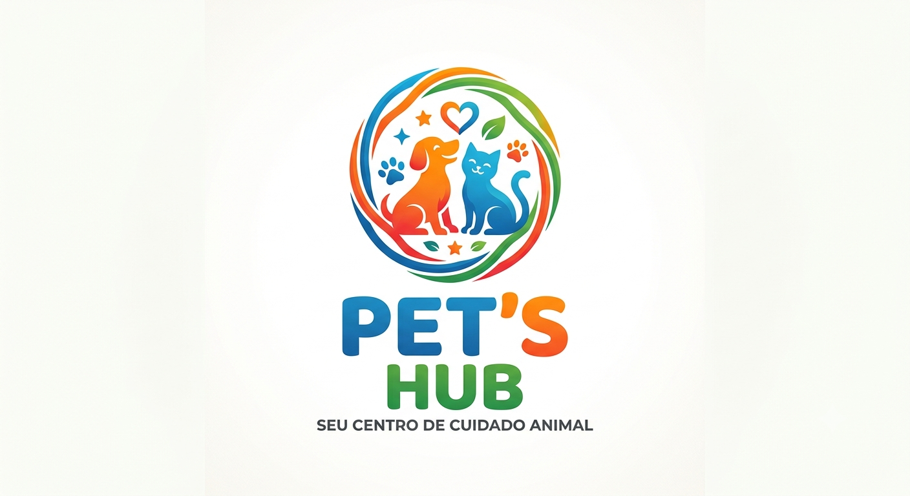

# 🎨 Documento de Identidade Visual - Pet's Hub

Este documento estabelece o padrão visual do sistema **Pet's Hub**, garantindo consistência na interface e na experiência do usuário.

---

## 1. Logo do Projeto
*(Abaixo está a representação visual da nossa marca)*



---

## 2. Paleta de Cores
As cores foram escolhidas para transmitir confiança, higiene e clareza operacional no fluxo de trabalho do petshop.

| Cor | Uso no Sistema | Hexadecimal |
| :--- | :--- | :--- |
| **Azul** | Serviços de Banho, Status "Andamento" e Destaques | `#0ea5e9` |
| **Laranja** | Tosa Higiênica e Status "Fila" / Espera | `#f59e0b` |
| **Verde** | Tosa Completa, Faturamento e Status "Pronto" | `#10b981` |
| **Vermelho** | Alertas médicos do Pet e Ações de Exclusão | `#ef4444` |
| **Cinza** | Textos principais, Bordas e Elementos neutros | `#64748b` |

---

## 3. Tipografia
Para manter um aspecto moderno, limpo e legível em qualquer tela, utilizamos o padrão do **Google Fonts**. Definimos pesos específicos (400 para normal, 500 para médio e 700 para negrito) para garantir a hierarquia da informação.

*   **Títulos e Cabeçalhos:** `Poppins` (Pesos: 400, 600, 700) - Transmite um ar moderno, amigável e arredondado.
*   **Textos e Parágrafos:** `Inter` (Pesos: 400, 500, 700) - Garante alta legibilidade para a leitura de dados, tabelas e cadastros no Dashboard.

### Códigos de Importação (Google Fonts)

**Opção 1: Via HTML (Inserir no `<head>` do `index.html`)**
```html
<link rel="preconnect" href="[https://fonts.googleapis.com](https://fonts.googleapis.com)">
<link rel="preconnect" href="[https://fonts.gstatic.com](https://fonts.gstatic.com)" crossorigin>
<link href="[https://fonts.googleapis.com/css2?family=Inter:wght@400;500;700&family=Poppins:wght@400;600;700&display=swap](https://fonts.googleapis.com/css2?family=Inter:wght@400;500;700&family=Poppins:wght@400;600;700&display=swap)" rel="stylesheet">